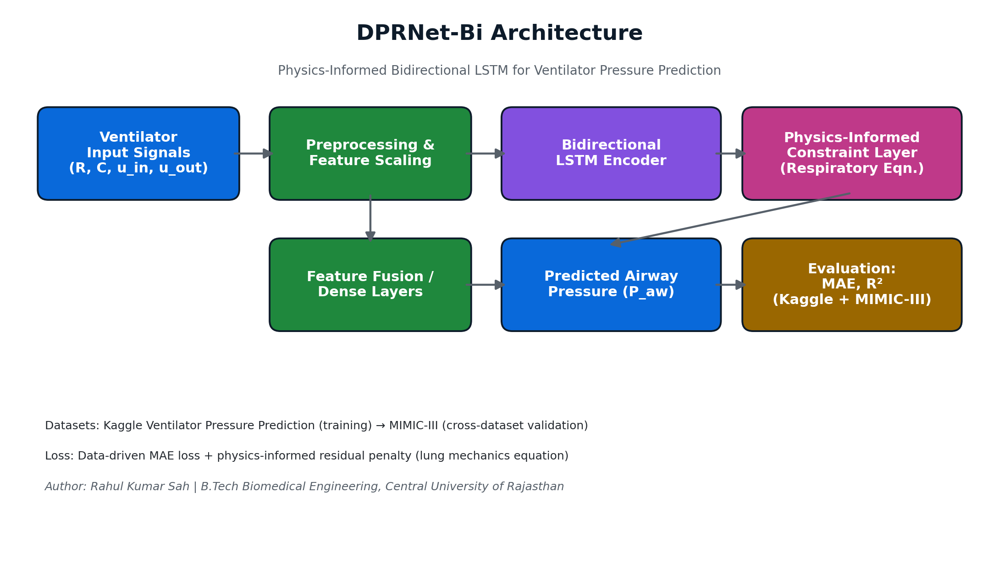
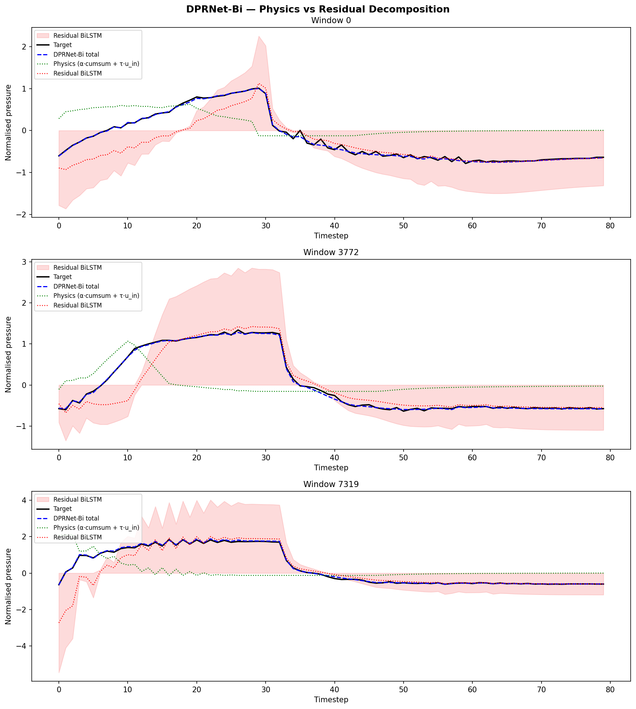
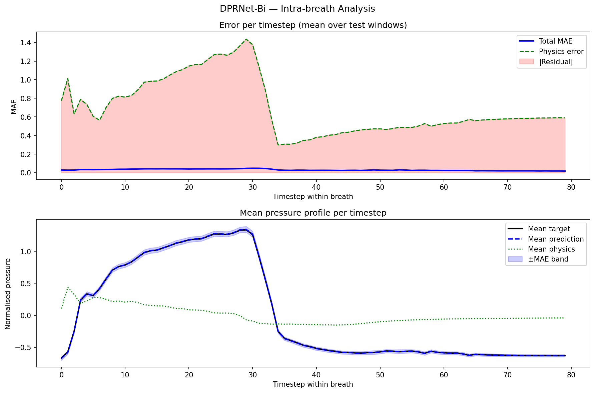

# 🫁 DPRNet-Bi: Physics-Informed Bidirectional LSTM for Ventilator Airway Pressure Prediction

[](https://www.python.org/)
[](https://pytorch.org/)
[](https://jupyter.org/)
[](LICENSE)

> A physics-informed Bidirectional LSTM framework for predicting ventilator airway pressure — built for biomedical time-series modeling and validated across datasets (Kaggle Ventilator Pressure Prediction + MIMIC-III).



---

## 📖 Project Overview

DPRNet-Bi combines deep learning with physiological/physics-based constraints to predict airway pressure from ventilator sensor signals (flow, control inputs, lung resistance/compliance). The physics-informed loss term helps the model generalize better across datasets than purely data-driven baselines.

Built with **Python**, **PyTorch**, and **Google Colab**.

## 🎯 Objectives

- Predict ventilator airway pressure accurately from time-series sensor data.
- Improve generalization using physics-informed modeling (lung mechanics equation as a soft constraint).
- Benchmark against classical ML and deep learning baselines (Linear/Ridge Regression, Random Forest, LSTM, BiGRU, XGBoost, BiLSTM).
- Evaluate cross-dataset robustness on MIMIC-III.

## ✨ Key Features

- Physics-Informed Bidirectional LSTM architecture
- Multi-model statistical benchmarking (9 baseline models)
- Feature importance analysis
- Training/validation curve visualization
- Cross-dataset evaluation (MIMIC-III)
- Fully reproducible in Google Colab

## 🛠 Tech Stack

Python · PyTorch · NumPy · Pandas · Matplotlib · Scikit-learn · Joblib · Google Colab

## 📂 Project Structure

```
DPRNet-Bi-Ventilator-Pressure-Prediction/
│
├── DPRNet_Bi_FIXED_Colab_(2).ipynb     # Main training/eval notebook
├── feature_scaler.pkl                  # Saved feature scaler
├── requirements.txt
├── README.md
├── model_comparison.csv                # Baseline vs DPRNet-Bi comparison
├── DPRNet_Bi_metrics.json              # Final metrics
├── DPRNet_Bi_feature_importance.csv
├── DPRNet_Bi_architecture_diagram.png
├── DPRNet_Bi_training_curves.png
├── DPRNet_Bi_eval.png
├── DPRNet_Bi_decomposition.png
├── DPRNet_Bi_intra_breath.png
├── DPRNet_Bi_physics_params.png
└── results/
    └── mimic3/                         # Cross-dataset validation outputs
        ├── mimic_prediction_vs_target.png   # (rename to match your actual file)
        ├── mimic_error_distribution.png     # (rename to match your actual file)
        └── mimic_errors.npz
```

## 🚀 Installation

```bash
git clone https://github.com/Rahul3682/DPRNet-Bi-Ventilator-Pressure-Prediction.git
cd DPRNet-Bi-Ventilator-Pressure-Prediction
pip install -r requirements.txt
```

## ▶️ Usage

Open and run `DPRNet_Bi_FIXED_Colab_(2).ipynb` sequentially to:

1. Load and preprocess the ventilator dataset
2. Train the DPRNet-Bi model
3. Predict airway pressure
4. Evaluate against baseline models
5. Generate result visualizations

## 📊 Results

### On Kaggle Ventilator Pressure Prediction (primary training/test set)

| Metric | Value |
|---|---|
| MAE | 0.0301 |
| R² | 0.9976 |

### Training Curves


### Model Evaluation


### Physics Parameters


### Signal Decomposition


### Intra-Breath Analysis


---

## 🏥 Cross-Dataset Validation on MIMIC-III

To test how well DPRNet-Bi generalizes beyond its training distribution, the trained model was evaluated on ICU ventilator data from **MIMIC-III**, a real-world critical care database — a much harder, out-of-distribution setting compared to the curated Kaggle benchmark.

| Metric | Value (MIMIC-III) |
|---|---|
| MAE | 0.2841 |
| R² | 0.8888 |

> ⚠️ **Important caveat:** MIMIC-III does not provide a direct, clean ground-truth airway pressure channel like the Kaggle dataset does. The evaluation here uses a **surrogate pressure target derived from the respiration signal**, not a true measured airway pressure. So this result is best read as a **generalization sanity check** — evidence the model produces physiologically reasonable outputs on real ICU data — rather than a like-for-like benchmark against the Kaggle numbers or a formal statistical comparison against baseline models.

**Evaluation outputs** (from `results/mimic3/`):


*(Replace the two filenames above with the actual plot filenames inside your `results/mimic3/` folder — GitHub image paths are case-sensitive and must match exactly.)*

**Files in this folder:**
- `mimic_errors.npz` — raw prediction error arrays for further analysis
- add any additional `.png`/`.csv` plots you generated for this validation run

## ⚠️ Note

The trained model weights (`.pt`) are not included due to GitHub's file size limits. The full training pipeline is reproducible via the provided notebook.

## 🔮 Future Work

- Transformer-based time-series models
- Explainable AI (XAI) for clinical interpretability
- Multi-center clinical validation
- Real-time ventilator monitoring integration
- Clinical decision support system

## 👨‍💻 Author

**Rahul Kumar Sah**
B.Tech Biomedical Engineering, Central University of Rajasthan
[GitHub](https://github.com/Rahul3682) · [LinkedIn](https://linkedin.com/in/rahul-kumar-sah-210970330) · rahulsah3682@gmail.com

## ⭐ Support

If you found this project useful, consider giving it a star on GitHub.
