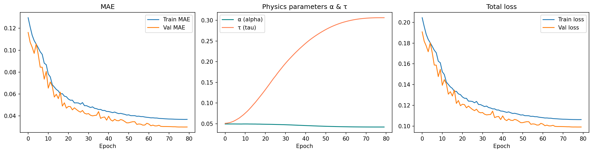
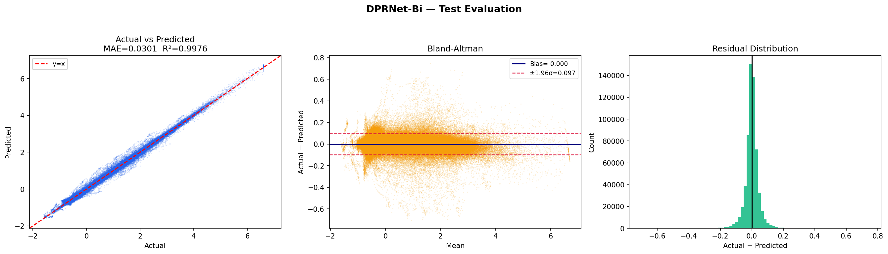
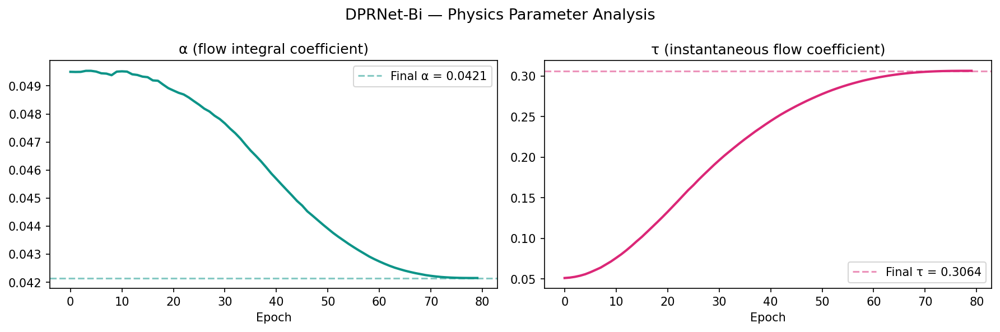

# 🫁 DPRNet-Bi: Physics-Informed Bidirectional LSTM for Ventilator Airway Pressure Prediction


---

## 📖 Project Overview

DPRNet-Bi is a Physics-Informed Bidirectional Long Short-Term Memory (Bi-LSTM) model developed for ventilator airway pressure prediction in biomedical applications. The framework combines deep learning with physiological constraints to improve prediction accuracy, robustness, and generalization.

This project is implemented using **Python**, **PyTorch**, and **Google Colab**.

---

## 🎯 Objectives

- Predict ventilator airway pressure accurately.
- Improve deep learning performance using physics-informed modeling.
- Analyze biomedical time-series data.
- Evaluate model performance on external datasets such as MIMIC-III.

---

## ✨ Key Features

- Physics-Informed Bidirectional LSTM Architecture
- Ventilator Airway Pressure Prediction
- Biomedical Time-Series Analysis
- Deep Learning using PyTorch
- Feature Importance Analysis
- Training and Validation Visualization
- Cross-Dataset Evaluation (MIMIC-III)
- Google Colab Compatible

---

## 🛠 Technologies Used

- Python
- PyTorch
- NumPy
- Pandas
- Matplotlib
- Scikit-learn
- Joblib
- Google Colab

---

## 📂 Project Structure

```text
DPRNet-Bi-Ventilator-Pressure-Prediction/
│
├── DPRNet_Bi_FIXED_Colab_(2).ipynb
├── feature_scaler.pkl
├── requirements.txt
├── README.md
├── model_comparison.csv
├── DPRNet_Bi_metrics.json
├── results/
│   ├── training/
│   └── mimic3/
└── images/
```

---

## 🚀 Installation

Clone the repository:

```bash
git clone https://github.com/Rahul3682/DPRNet-Bi-Ventilator-Pressure-Prediction.git
```

Move into the project folder:

```bash
cd DPRNet-Bi-Ventilator-Pressure-Prediction
```

Install the required packages:

```bash
pip install -r requirements.txt
```

---

## ▶️ Usage

Open the notebook:

```text
DPRNet_Bi_FIXED_Colab_(2).ipynb
```

Run all notebook cells sequentially to:

- Load the dataset
- Train the DPRNet-Bi model
- Predict ventilator airway pressure
- Evaluate model performance
- Generate result visualizations

---

## 📊 Results

This repository includes:

- Training Curves
- Model Evaluation
- Feature Importance Analysis
- Physics Parameter Visualization
- Performance Metrics
- Model Comparison
- MIMIC-III Evaluation Results

---
## 📸 Project Results

### Training Curves



---

### Model Evaluation



---

### Physics Parameters



---

### Feature Importance


---

### MIMIC-III Evaluation


## 📸 Sample Results

### Training Performance

*(Add your training curve image here)*

### Model Evaluation

*(Add your evaluation graph here)*

### MIMIC-III Evaluation

*(Add your MIMIC-III evaluation image here)*

---

## 📈 Model Evaluation

The proposed DPRNet-Bi model was evaluated using multiple regression metrics and validated on the MIMIC-III dataset to assess its robustness and generalization across different clinical data.

---

## ⚠️ Note

The trained model (`.pt`) file is not included in this repository because it exceeds GitHub's web upload size limit. The complete training pipeline is available in the provided notebook.

---

## 🔮 Future Work

- Transformer-based Time-Series Models
- Explainable AI (XAI)
- Multi-Center Clinical Validation
- Real-Time Ventilator Monitoring
- Clinical Decision Support Systems

---

## 👨‍💻 Author

**Rahul Kumar Sah**

B.Tech in Biomedical Engineering

Central University of Rajasthan

GitHub: https://github.com/Rahul3682

---

## ⭐ Support

If you found this project useful, please consider giving it a ⭐ on GitHub.
